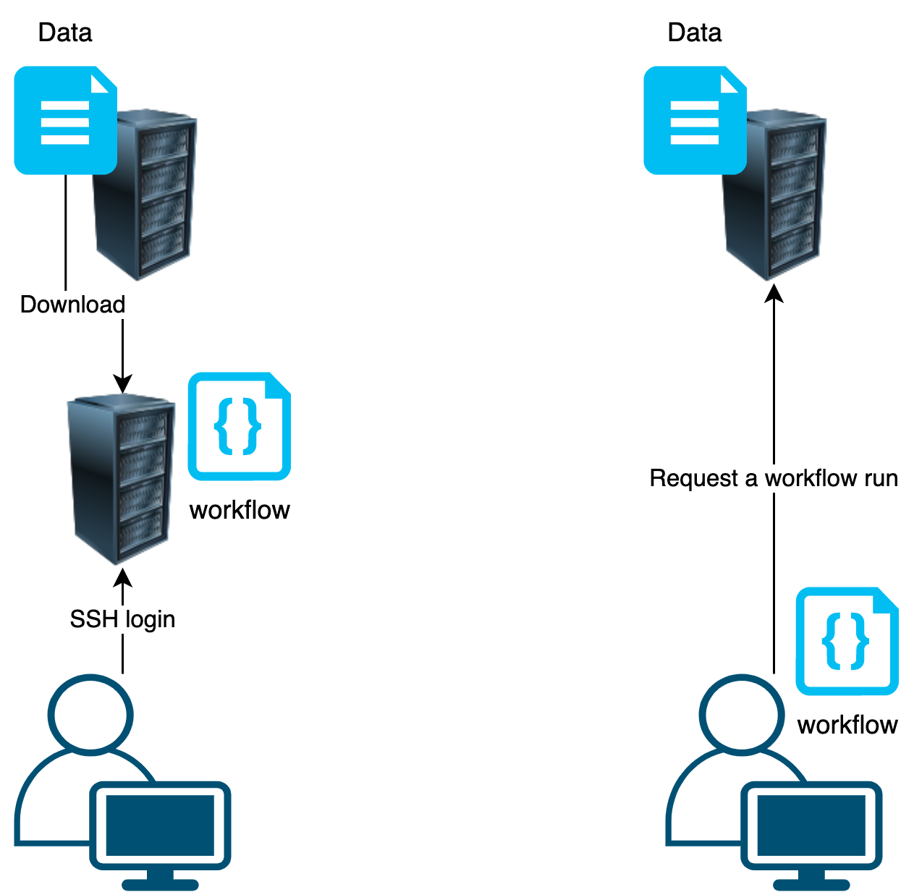

# Project 18

## Title:

Cloud-native data analysis workflow execution service and quality assessment of published workflows

## Welcome!

- Programmers/Data scientists
  - Help and improve our implementations
- Workflow developers
  - Test your workflow with Sapporo/Tonkaz
- Administrators
  - Test our WES implementation on your environment
- Anyone just interested
  - I got some sweets and tea from Japan!

## Team leader:

 * Name: Tazro Ohta
 * Contact: t.ohta@dbcls.rois.ac.jp

## Members

- Add your name!

## Tasks

- Update the RO-crate implementation: https://github.com/sapporo-wes/sapporo-service/pull/32
- Increase the coverage of feature calculation
  - candidates:
    - [gffutils](https://gffutils.readthedocs.io/en/latest/) for GFF/GTF
    - [bedtools]()
  - Add a new function in [ro-crate.py](https://github.com/sapporo-wes/sapporo-service/blob/main/sapporo/ro_crate.py)

## About

### Background: Data analysis workflow in Bioinformatics


From: https://carpentries-incubator.github.io/cwl-novice-tutorial/aio/index.html

### Idea: Bring Workflow to Data

Too many/large/distributed/sensitive data to move!



### Implementations: for cloud-based data analysis

- Infrastructure: [DDBJ Supercomputer system](https://sc.ddbj.nig.ac.jp)
  - A shared computing cluster for researchers in Japan
  - Sharing genomic data with NCBI/EBI
- Workflow Execution Service: [Sapporo](https://github.com/sapporo-wes/sapporo-service)
  - WES that supports CWL/WDL/Nextflow/Snakemake
- Tool Registry Service: [Yevis](https://github.com/sapporo-wes/yevis-cli)
  - GitHub-based Workflow registry with automated testing

The [GA4GH Cloud standards](https://ga4gh-cloud.github.io/) compatible!

### Problem: Tools/Workflows may not work

Because:

- CPU arch is not compatible
- Required hardware is not found
- Workflow engine or its version is incompatible
- Input parameters are not valid
- A tool has been updated
- A remote file is missing or changed

*How can we be sure that a workflow is working as expected?*

### Our solution: Tonkaz, Workflow reproducibility checker

```
$ ./tonkaz ./tests/example_crate/rnaseq_1st.json ./tests/example_crate/rnaseq_2nd.json
Tonkaz 0.2.4

Checking Crate2 based on Crate1:

  Crate1: ./tests/example_crate/rnaseq_1st.json
  Crate2: ./tests/example_crate/rnaseq_2nd.json

.----------------------------------------------------------------------------------------------.
|                |                Crate1                |                Crate2                |
|----------------|--------------------------------------|--------------------------------------|
| WF Name        | nf-core - rnaseq                     | nf-core - rnaseq                     |
| WF ID          | 20da6ea5-de91-4973-ac20-216882357a0d | 20da6ea5-de91-4973-ac20-216882357a0d |
| WF Ver         | 1.0.0                                | 1.0.0                                |
| WF Type        | Nextflow                             | Nextflow                             |
| WF Type Ver    | 1.0                                  | 1.0                                  |
| WF Eng Name    | nextflow                             | nextflow                             |
| WF Eng Version | 22.04.4                              | 22.04.4                              |
| Sapporo Ver    | 1.4.8                                | 1.4.8                                |
| Run Name       | example_test                         | example_test                         |
| Run State      | COMPLETE                             | COMPLETE                             |
| ExitCode       | 0                                    | 0                                    |
| Start Time     | 2022-09-08 06:28:11                  | 2022-09-08 06:08:01                  |
| End Time       | 2022-09-08 06:45:53                  | 2022-09-08 06:25:56                  |
| Duration       | 17m 42s                              | 17m 55s                              |
| # Attachments  | 147 files                            | 147 files                            |
| # Intermediate | 3342 files                           | 3342 files                           |
| # Outputs      | 872 files (25 EDAM-assigned files)   | 872 files (25 EDAM-assigned files)   |
'----------------------------------------------------------------------------------------------'

Comparing workflow results...
Calculate the reproducibility level by comparing the EDAM-assigned output files of Crate1 and Crate2. (option `--all` to use all output files)

Reproducibility level is defined as follows:

  - Level3 ⭐⭐⭐ : Files are identical with the same checksum
  - Level2 ⭐⭐   : Files are different, but their features (file size, map rate, etc.) are similar (within threshold: 0.05)
  - Level1 ⭐     : Files are different, and their features are different (beyond threshold)
  - Level0        : File not found

Level3: "Fully Reproduced" <---> Level0: "Not Reproduced"

...

Summarize compare result:

  .---------------------------------------------------------------------------.
  |      Reproducibility      |   Level   |     Definition      |   File #    |
  |---------------------------|-----------|---------------------|-------------|
  | Fully Reproduced          | ⭐⭐⭐    | Same Checksum       | 20 files    |
  | Acceptable Differences    | ⭐⭐      | Similar Features    | 5 files     |
  | Unacceptable Differences  | ⭐        | Different Features  | 0 files     |
  | Not Reproduced            |           | Not Found           | 0 files     |
  '---------------------------------------------------------------------------'
```

### File comparison targets

Using [EDAM: Ontology of bioscientific data analysis and data management](https://edamontology.org/)

|File format|EDAM ontology ID|Tool|Features|
|:-|:-|:-|:-|
|FASTA|format_1929|||
|FASTQ|format_1930|||
|GFF|format_1975|||
|GTF|format_2306|||
|SAM|format_2573|samtools|total/mapped/unmapped reads/rates|
|BAM|format_2572|samtools|total/mapped/unmapped reads/rates|
|BED|format_3003|||
|BigBed|format_3004|||
|Wig|format_3005|||
|BigWig|format_3006|||
|VCF|format_3016|vcftools|variant/SNPs/indels count|


### Resources

- DDBJ Supercomputer system: https://sc.ddbj.nig.ac.jp/
- Sapporo WES: https://github.com/sapporo-wes/sapporo-service
- Yevis, registry builder: https://github.com/sapporo-wes/yevis-cli
- Tonkaz, reproducibility checker: https://github.com/sapporo-wes/tonkaz
- RO-crate: https://www.researchobject.org/ro-crate/
  - Workflow Run Crate: https://www.researchobject.org/workflow-run-crate/
- EDAM ontology: https://edamontology.org/

### Preprints

- Sapporo: [10.12688/f1000research.122924.1](https://doi.org/10.12688/f1000research.122924.1)
- Yevis: [10.1101/2022.07.08.499265](https://doi.org/10.1101/2022.07.08.499265) (just accepted by [GigaScience](https://academic.oup.com/gigascience))
- Tonkaz: [10.1101/2022.10.11.511695](https://doi.org/10.1101/2022.10.11.511695)